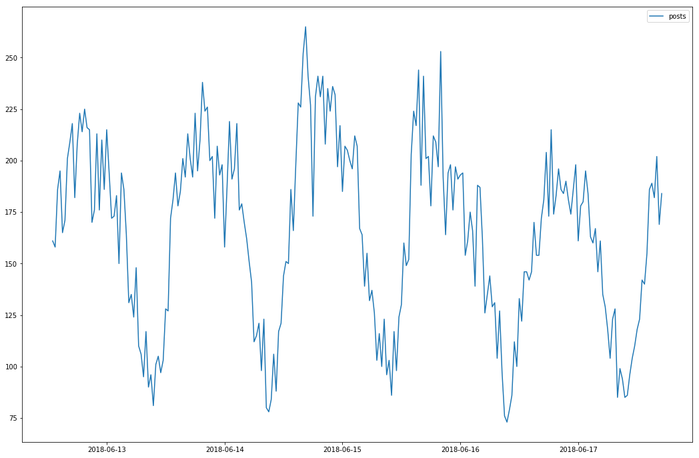

# Reddit Posts Forecaster


 Use statsmodels to predict posts in a given date.

### Installation

Install the dependencies.

```sh
$ virtualenv env
$ source env/bin/activate
$ pip install -r requirements.txt
```


### Development

```python   
# create sqlite.db and populate it
from app.recollect import pull_save_data
from time import sleep
sleep(1)
pull_save_data()
```

Method which takes in two timestamps, a `ts_from` and a `ts_to`. Pull all posts between these two timestamps from the database and return a dataframe with 1 column called `count` containing the number of posts in `30` minute increments.


```python   
# create sqlite.db and populate it
# `get_post` function
>>> from main import get_posts
>>> from datetime import datetime, timedelta

>>> now = datetime.now()
>>> six_hours_ago = now - timedelta(hours=6)

>>> posts = get_posts(six_hours_ago, now)
>>> posts.head()
```

| created_at          |   permalink |
|:--------------------|------------:|
| 2018-06-17 11:30:00 |         110 |
| 2018-06-17 12:00:00 |         118 |
| 2018-06-17 12:30:00 |         123 |
| 2018-06-17 13:00:00 |         142 |
| 2018-06-17 13:30:00 |         140 |

Create another function which `plots` this dataframe so we could see the frequency of posts on the subreddit.

```python
# import libs
>>> from main import plots, get_posts
>>> from datetime import datetime
>>> import matplotlib.pylab as plt

>>> posts = get_posts(None, datetime.now() )
>>> plots(posts)
```





Making `predictions`

```python
>>> from main import predict
>>> from datetime import datetime
>>> ts  = datetime(2018, 6, 18, 16, 2)
# this is the prediction of the number of posts between
# 2018-06-18 16:02:00 and 2018-06-18 16:03:00
>>> predict(ts)
364
```


### Dependencies

* beautifulsoup4
* matplotlib
* mysqlclient
* numpy
* pandas
* requests
* statsmodels
* SQLAlchemy
* sklearn
